# mass-spectrometry-counts

[](https://github.com/LucaCappelletti94/mass-spectrometry-counts/actions/workflows/ci.yml)
[](LICENSE)
[](https://doi.org/10.5281/zenodo.18986343)

Count your peaks! Bucket counts and co-occurrences from as many spectra as possible.

## Abstract

Standard spectral similarity measures such as cosine similarity treat all peaks equally, ignoring the fact that some fragment ions (e.g. low-mass hydrocarbon cations) appear in over half of all spectra while others are highly specific. [Count your bits](https://doi.org/10.1101/2025.06.16.659994) showed that count-based molecular fingerprint variants substantially improve specificity for molecular similarity; analogous considerations apply to spectral peak matching, where frequency information is currently discarded. To enable frequency-aware alternatives, we compute corpus-level statistics from large-scale tandem mass spectrometry datasets: per-bucket spectrum counts (how many spectra contain a peak in each m/z (mass-to-charge ratio) bin) and the full pairwise co-occurrence matrix (how many spectra contain peaks in both bin *i* and bin *j*). The resulting matrices are [published on Zenodo](https://doi.org/10.5281/zenodo.18986343).

We process **23.5 million spectra** from the GeMS-A10 dataset at two resolutions: **0.1 Da** (32.9M nonzero co-occurrence entries) and **0.01 Da** (753.2M entries, 1.6 GB sparse matrix). The bucket count distribution is approximately log-normal with extreme skew and a compressed upper tail. Pointwise Mutual Information (PMI) normalization of the co-occurrence matrix reveals association structure consistent with known mass spectrometry chemistry: a distinct high-m/z subpopulation (800--1000 Da, likely ¹³C isotope clusters from large lipids or glycopeptides) with PMI up to +16 bits, compound class segregation between low-m/z and mid-m/z fragments (-6 to -8 bits PMI), and 14 Da homologous-series striping. The general positive bias in co-occurrence (obs/exp peaking at +2 to +4 bits) reflects the latent compound-class structure of the dataset.

These explicit corpus-level statistics enable frequency-aware spectral similarity metrics, such as Inverse Document Frequency (IDF)-weighted cosine, PMI-based cross-peak scoring, and Positive PMI (PPMI)-derived peak embeddings, analogous to techniques from Natural Language Processing (NLP) and information retrieval (see [Future work](#future-work)). Prior work has shown that fragment co-occurrence carries structural information: [Spec2Vec](https://pmc.ncbi.nlm.nih.gov/articles/PMC7909622/) learns this implicitly via Word2Vec-style embeddings, [MS2LDA](https://www.pnas.org/doi/10.1073/pnas.1608041113) discovers co-occurring fragment motifs through topic modeling, and [DreaMS](https://www.nature.com/articles/s41587-025-02663-3) uses masked peak prediction on the same GeMS dataset. None of these methods produce the raw count and co-occurrence matrices directly; this project fills that gap by precomputing them at corpus scale.

## Dataset

This tool is designed for the [GeMS](https://huggingface.co/datasets/roman-bushuiev/GeMS) ([GNPS](https://gnps.ucsd.edu/) (Global Natural Products Social Molecular Networking) Experimental Mass Spectra) dataset by Bushuiev et al. The default configuration downloads and processes the **A10 split**:

- **23,517,534** tandem mass spectra of small molecules
- HDF5 format, `(N, 2, 128)` float64 arrays (m/z + intensity, zero-padded)
- ~14.6 GB, auto-downloaded to `~/.cache/mass-spectrometry-counts`

## Building

```bash
cargo build --release
```

### System dependencies

The HDF5 C library is required:

```bash
# Ubuntu/Debian
sudo apt install libhdf5-dev pkg-config libssl-dev
```

## Usage

By default the tool downloads the [GeMS-A10](https://huggingface.co/datasets/roman-bushuiev/GeMS) dataset (~14.6 GB, ~23.5M spectra) from HuggingFace and processes it:

```bash
cargo run --release
```

To use a local HDF5 file instead:

```bash
cargo run --release -- --input path/to/spectra.hdf5
```

### Options

| Flag | Description | Default |
|------|-------------|---------|
| `-i, --input <FILE>` | Local HDF5 file (skips download) | *(downloads GeMS-A10)* |
| `--bin-width <DA>` | Bucket width in Daltons | `0.1` |
| `--min-mz <MZ>` | Minimum m/z value | `0.0` |
| `--max-mz <MZ>` | Maximum m/z value | `2000.0` |
| `-o, --output-dir <DIR>` | Output directory | `results` |
| `-t, --threads <N>` | Number of threads for parallel processing | `4` |
| `--batch-size <N>` | HDF5 read batch size | `10000` |
| `--cache-dir <DIR>` | Download cache directory | `~/.cache/mass-spectrometry-counts` |

### Examples

With custom bin width and 8 threads:

```bash
cargo run --release -- \
  --input data.hdf5 \
  --bin-width 0.05 \
  --min-mz 50.0 \
  --max-mz 1500.0 \
  --threads 8 \
  --output-dir results/
```

## Input format

HDF5 files with a `/spectrum` dataset of shape `(N, 2, 128)` float64:

- `spectrum[i, 0, :]` = m/z values (zero-padded to 128)
- `spectrum[i, 1, :]` = intensity values (zero-padded to 128)

This is the format used by the [GeMS](https://huggingface.co/datasets/roman-bushuiev/GeMS) dataset.

## Output

The tool writes two files to the output directory:

### `cooccurrence.npz`

Sparse co-occurrence matrix in scipy-compatible Compressed Sparse Row (CSR) format (`scipy.sparse.load_npz`). The matrix is `num_buckets x num_buckets`, upper triangle only (i <= j). Diagonal entries (i == i) are the per-bucket counts.

```python
import scipy.sparse as sp

mat = sp.load_npz("results/0.1da/cooccurrence.npz")      # upper triangle
mat_full = mat + mat.T - sp.diags(mat.diagonal())         # symmetric
counts = mat.diagonal()                                    # per-bucket counts
```

### `metadata.json`

```json
{
  "min_mz": 0.0,
  "max_mz": 2000.0,
  "bin_width": 0.1,
  "num_buckets": 20000,
  "num_spectra": 23517534,
  "num_nonzero_entries": 32899680
}
```

## Results

Results from the GeMS-A10 run (23,517,534 spectra) at two resolutions:

| | 0.1 Da | 0.01 Da |
|---|---|---|
| Total buckets | 20,000 | 200,000 |
| Active buckets | 9,618 | 95,070 |
| Nonzero co-occurrence entries | 32.9M | 753.2M |
| NPZ file size | 58 MB | 1.6 GB |

### Bucket counts (0.1 Da)

#### Log scale

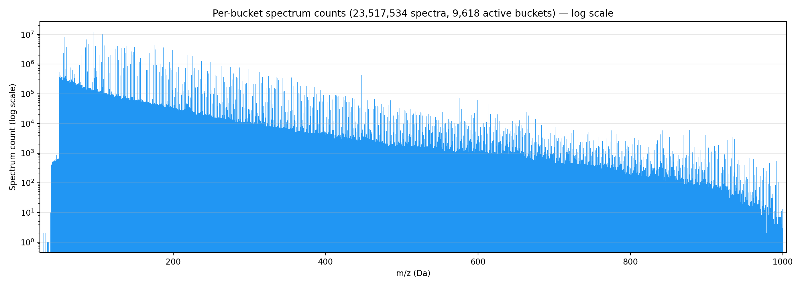

9,618 active buckets spanning m/z ~30--1000. The y-axis is log-scale spectrum count. The distribution spans 7 orders of magnitude (1 to ~12.3M). A dense forest of peaks fills the region below 200 Da, with a gradual decay toward higher masses. The log scale reveals that even the rarest buckets near 1000 Da still carry signal (counts of 1--100).

#### Linear scale

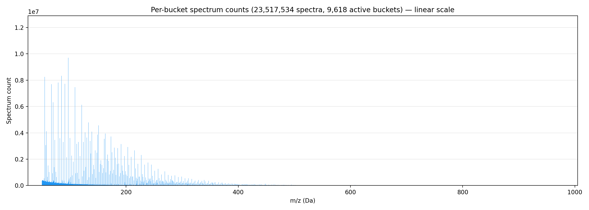

Same data on a linear y-axis, making the extreme skew visible: virtually all mass is concentrated below 200 Da. The top peak at m/z ~95 reaches ~12.3M counts (~52% of all spectra).

### Bucket counts (0.01 Da)

#### Log scale

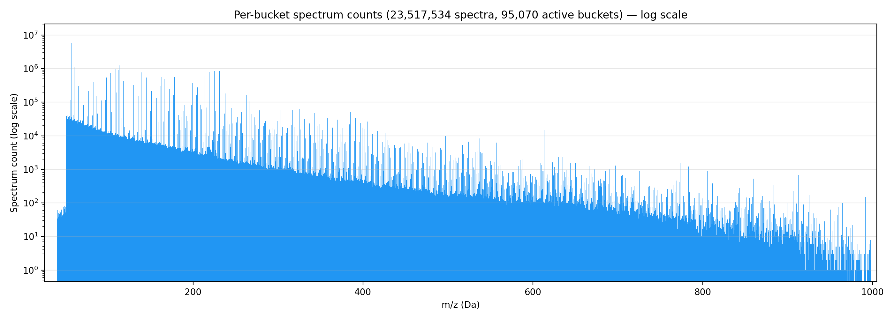

95,070 active buckets at 0.01 Da resolution. The same m/z range and overall shape as the 0.1 Da plot, but individual peaks are much sharper and more resolved. The count range is similar (1 to ~9.7M).

#### Linear scale

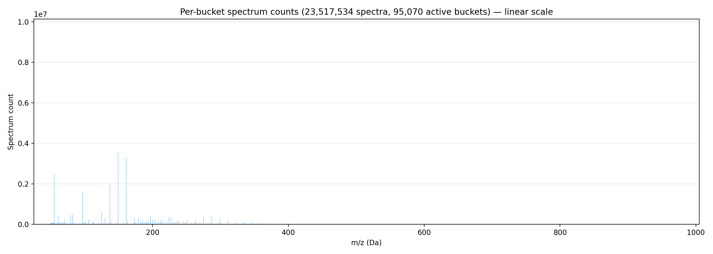

At 0.01 Da, counts that were aggregated into single 0.1 Da bins are now spread across finer bins. The highest peak (m/z 95.09) reaches ~9.7M (vs ~12.3M at 0.1 Da), indicating that most of the 0.1 Da bin's count concentrates in a single 0.01 Da sub-bin. The linear plot appears sparser because the many lower-count bins surrounding each dominant peak are now individually resolved.

### Most common peaks

Top-10 m/z buckets by spectrum count (0.1 Da bins). Each bin spans 0.1 Da; the m/z column shows the bin center (e.g., 95.05 = bin [95.0, 95.1)). Candidate formulas are the simplest CₙHₘ or CₙHₘO cations whose exact monoisotopic masses fall within the bin:

| Rank | m/z (center) | Count | % spectra | Candidate formula | Exact mass |
|------|-------------|------:|----------:|-------------------|-----------|
| 1 | 95.05 | 12.3M | 52.2% | C₇H₁₁⁺ | 95.086 |
| 2 | 81.05 | 12.0M | 50.9% | C₆H₉⁺ | 81.070 |
| 3 | 83.05 | 11.2M | 47.6% | C₆H₁₁⁺ | 83.086 |
| 4 | 107.05 | 10.2M | 43.4% | C₈H₁₁⁺ | 107.086 |
| 5 | 97.05 | 9.7M | 41.2% | C₆H₉O⁺ (97.065) or C₇H₁₃⁺ (97.101) | — |
| 6 | 93.05 | 9.7M | 41.1% | C₇H₉⁺ | 93.070 |
| 7 | 69.05 | 9.4M | 39.9% | C₅H₉⁺ | 69.070 |
| 8 | 105.05 | 8.4M | 35.6% | C₈H₉⁺ | 105.070 |
| 9 | 85.05 | 8.3M | 35.4% | C₅H₉O⁺ (85.065) or C₆H₁₃⁺ (85.101) | — |
| 10 | 55.05 | 8.2M | 35.1% | C₄H₇⁺ | 55.054 |

At 0.01 Da, these bins resolve into sharper peaks. For example, the 0.01 Da peak at m/z 95.09 is consistent with C₇H₁₁⁺ (95.086, +4.5 mDa), while the 97.05 bin splits into m/z 97.06 (consistent with C₆H₉O⁺ at 97.065) and m/z 97.10 (consistent with C₇H₁₃⁺ at 97.101), revealing that the 0.1 Da bin conflates at least two distinct ions.

**These are candidate assignments only.** At 0.1 Da resolution, each bin contains multiple possible molecular formulas, and proper identification would require cross-referencing against annotated spectral libraries (e.g., GNPS, MassBank) or in-silico fragmentation tools (e.g., SIRIUS, CFM-ID (Competitive Fragmentation Modeling for metabolite Identification)). No formal database lookup was performed; the formulas shown are consistent with hydrocarbon and terpenoid fragments commonly reported in mass spectrometry literature but are not uniquely determined.

Notable patterns: 14 Da (CH₂) homologous-series spacing is visible in the hydrocarbon series (55, 69, 83, 97) and a parallel series (81, 95, 109, 123 -- the latter two at ranks #19 and #20 with 7.5M and 7.5M counts respectively). m/z 91.05 (#16 overall, 7.7M counts) could be C₇H₇⁺ (91.054), the well-known tropylium ion characteristic of aromatic compounds.

### Bucket count distribution

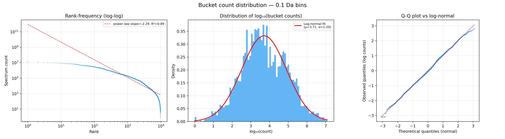

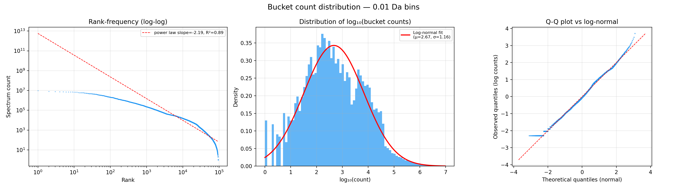

The rank-frequency plots (left panels) show that neither a pure power law nor a simple log-normal fully captures the distribution. Power-law fits give slope ≈ -2.2 to -2.3 with R² = 0.89. The log₁₀ histograms (center panels) are roughly bell-shaped, confirming an **approximately log-normal** distribution (0.1 Da: μ₁₀ = 3.71, σ₁₀ = 1.20; 0.01 Da: μ₁₀ = 2.67, σ₁₀ = 1.16). The Quantile-Quantile (Q-Q) plots (right panels) show good agreement with log-normal in the body, with departure at both tails: excess very-low-count buckets and upper-tail compression from the finite-N ceiling (counts bounded by 23.5M spectra).

Summary statistics:

| Statistic | 0.1 Da | 0.01 Da |
|-----------|--------|---------|
| Min | 1 | 1 |
| P25 | 742 | 69 |
| Median | 4,416 | 399 |
| Mean | 133,138 | 15,652 |
| P75 | 41,456 | 3,666 |
| P99 | 3,096,238 | 238,599 |
| Max | 12,282,382 | 9,658,684 |

The 30× ratio between mean and median at 0.1 Da (40× at 0.01 Da) reflects the extreme right skew. The distribution is **not geometric** (which would have a much thinner exponential tail), **not Zipfian** (the head is too flat and slope too steep), but **approximately log-normal with a compressed upper tail** due to the finite-N ceiling. (This characterization is based on Q-Q plots and histogram shape; no formal goodness-of-fit test was applied.)

At 0.1 Da, **no single bucket exceeds 3σ in log-space** -- the top fragments are high but statistically consistent with the fat tail of the log-normal (σ₁₀ = 1.20, so 3σ spans ~7 orders of magnitude). At 0.01 Da, **152 buckets cross the z > 3 threshold** because the finer bins separate signal from noise more sharply: dominant fragments concentrate into narrow 0.01 Da peaks while the remainder of each 0.1 Da-wide region contributes little.

### Co-occurrence distribution

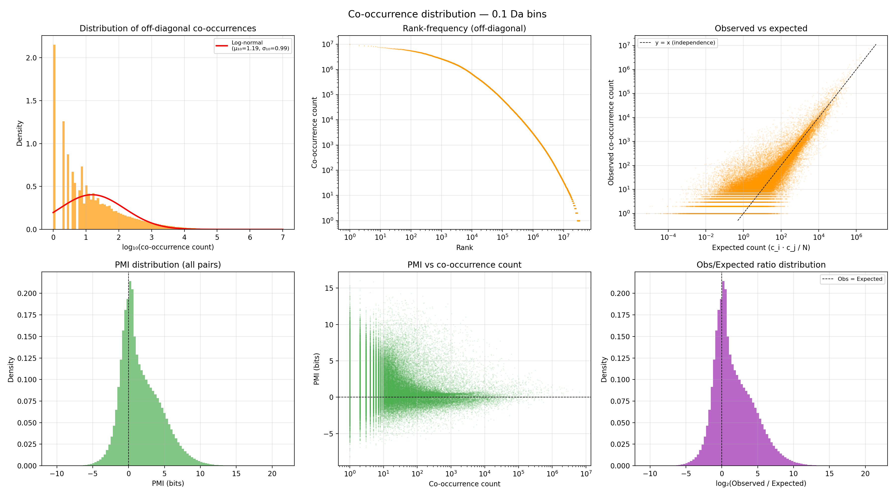

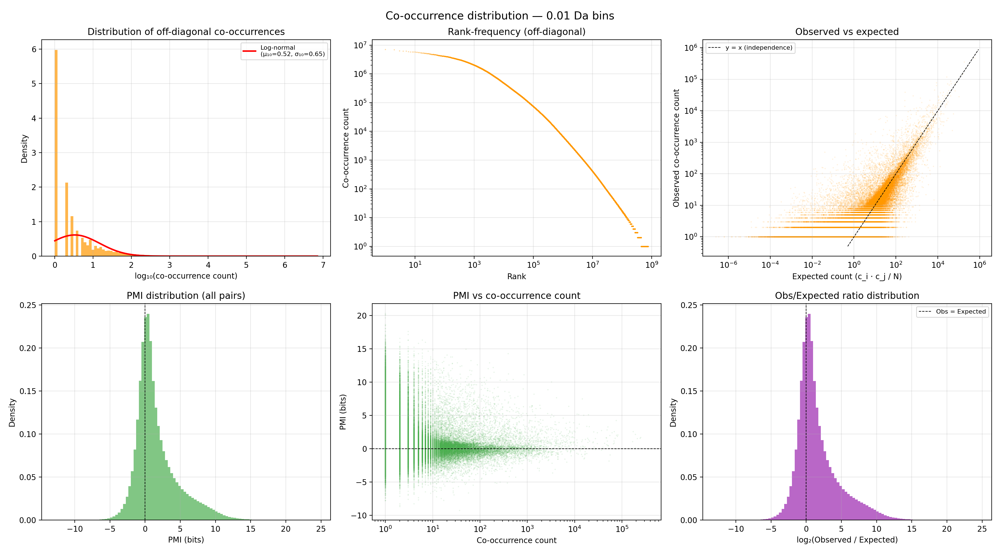

The co-occurrence counts are also approximately log-normal (top-left panels), even more skewed than the bucket counts: median co-occurrence is just 10 at 0.1 Da (2 at 0.01 Da), while the maximum reaches 10M (7.1M). The rank-frequency plots (top-center) show a smooth decay spanning 7 orders of magnitude.

**Observed vs expected** (top-right panels): the scatter of observed co-occurrence count vs the independence baseline (c_i · c_j / N) shows the cloud sitting consistently **above** the y = x line. The log₂(obs/exp) distribution (bottom-right) peaks at +2 to +4 bits, meaning peaks that co-occur at all tend to co-occur more than random chance predicts. This positive bias is expected: all fragments from a single precursor ion necessarily co-occur in the same spectrum, and the dataset has latent compound-class structure (terpenes, lipids, peptides) where fragments within a class are positively associated -- analogous to word co-occurrence within topic-specific documents in NLP. This is the same statistical structure exploited by [Spec2Vec](https://pmc.ncbi.nlm.nih.gov/articles/PMC7909622/) and [MS2LDA](https://www.pnas.org/doi/10.1073/pnas.1608041113).

**PMI distribution** (bottom-left panels): centered near 0 with a slight positive skew (mean 0.45 bits at 0.1 Da, 0.66 bits at 0.01 Da) and long tails reaching ±15--16 bits.

#### Top co-occurring pairs by raw count (0.1 Da)

| Rank | m/z_i | m/z_j | Count | Obs/Exp |
|------|-------|-------|------:|--------:|
| 1 | 81.1 | 95.1 | 10.1M | 1.61 |
| 2 | 83.1 | 95.1 | 9.0M | 1.53 |
| 3 | 81.1 | 83.1 | 8.9M | 1.56 |
| 4 | 95.1 | 107.1 | 8.6M | 1.61 |
| 5 | 93.1 | 95.1 | 8.5M | 1.69 |

These are pairs of ubiquitous low-mass fragments, each appearing in 30--50% of spectra. Their raw co-occurrence counts are enormous (8--10M) but the obs/exp ratios are modest (1.5--1.7×) -- they co-occur a lot primarily because they're individually common, not because they have an unusually strong association. Their co-occurrence is consistent with shared origins in terpenoid and steroid fragmentation: structurally related compounds produce overlapping sets of fragment ions via retro-Diels-Alder and other ring-cleavage pathways.

#### Genuinely surprising co-occurrences (highest PMI)

The pairs with the highest PMI (15--16 bits, min support ≥ 235) are all in the **high-m/z region (760--985 Da)**: fragments with individual counts of 250--700 that co-occur ~250 times despite expected counts under independence of < 1.

| Rank | m/z_i | m/z_j | PMI (bits) | Count | c_i | c_j |
|------|-------|-------|----------:|------:|----:|----:|
| 1 | 948.6 | 949.6 | 15.3 | 267 | 387 | 408 |
| 2 | 967.7 | 968.7 | 15.3 | 435 | 554 | 472 |
| 3 | 981.7 | 982.7 | 15.2 | 423 | 583 | 464 |
| 4 | 980.5 | 981.5 | 15.0 | 626 | 682 | 662 |
| 5 | 827.6 | 846.6 | 15.9 | 243 | 321 | 284 |

These represent a **distinct spectral subpopulation** of high-molecular-weight compounds whose fragments almost never appear in spectra of smaller molecules. The +1 Da spacing in several pairs (948/949, 967/968, 981/982) is consistent with **¹³C isotope peaks**: at 800--1000 Da, organic molecules contain ~50--70 carbon atoms, making the M+1 isotopologue peak 55--77% as intense as the monoisotopic peak. When both are co-isolated within a typical 1--2 Da precursor isolation window and co-fragmented, they produce parallel fragment series separated by ~1 Da. Alternatively, these high-m/z "fragments" may be poorly fragmented or intact precursor ions rather than true Collision-Induced Dissociation (CID) products, since fragments at 800--1000 Da require very large precursors. The mass range is consistent with large glycerophospholipids, triacylglycerols, or glycopeptides. This is the same population visible as the bright red block in the upper-right corner of the PMI heatmaps.

#### Most anti-correlated pairs (lowest PMI)

The strongest negative PMI pairs (-6 to -8 bits) pair **low-m/z fragments (90--132 Da) with mid-m/z fragments (225--450 Da)**:

| Rank | m/z_i | m/z_j | PMI (bits) | Count | c_i | c_j |
|------|-------|-------|----------:|------:|----:|----:|
| 1 | 126.0 | 247.1 | -7.9 | 240 | 1.9M | 678K |
| 2 | 126.0 | 241.1 | -7.7 | 246 | 1.9M | 614K |
| 3 | 114.0 | 271.1 | -7.6 | 332 | 3.8M | 411K |
| 4 | 108.0 | 247.1 | -7.5 | 258 | 1.6M | 678K |
| 5 | 97.0 | 229.1 | -7.5 | 429 | 1.6M | 1.1M |

These peaks each appear in hundreds of thousands to millions of spectra, yet almost never in the same spectrum. This is best explained by **compound class segregation** in the dataset: the low-m/z fragments (90--132 Da) include small hydrocarbon cations and possibly amino acid immonium ions characteristic of peptide fragmentation, while the mid-m/z fragments (225--450 Da) may include acylium ions, lipid-class-specific fragments, and terpenoid backbone fragments. A given spectrum typically comes from either a peptide-like or a lipid-like precursor -- rarely both. This segregation may be further amplified by differences in collision energy and instrument type across the heterogeneous GNPS/[MassIVE](https://massive.ucsd.edu/) (Mass Spectrometry Interactive Virtual Environment) collection underlying GeMS.

### Raw co-occurrence heatmap

#### 0.1 Da

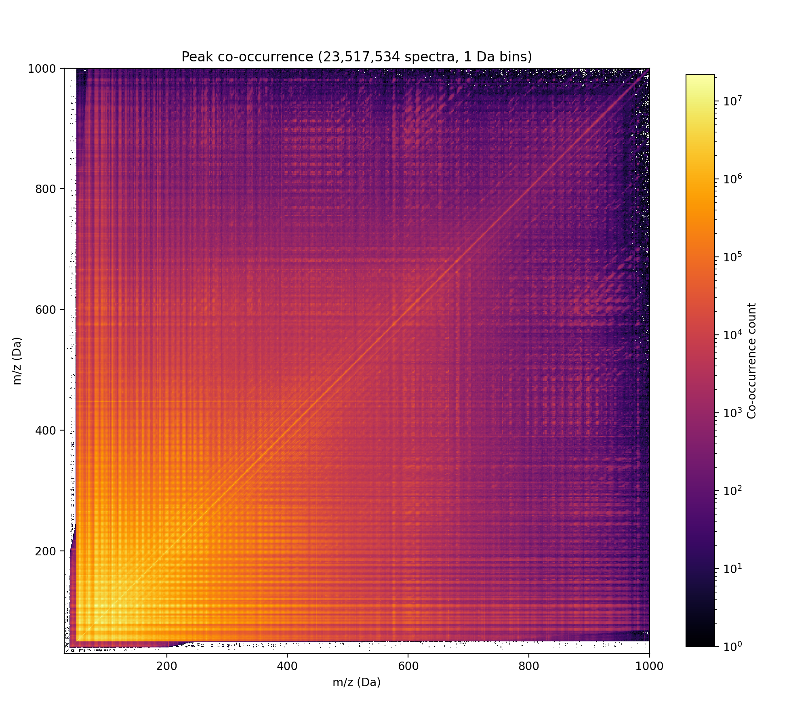

Symmetric matrix, 1 Da bins (10× downsampled from 0.1 Da), inferno colormap with LogNorm (1 to 10⁷). The dominant structure is a bright hot region in the low-m/z corner (below 200×200 Da) reflecting the high marginal frequencies of common fragments. Prominent horizontal and vertical bands correspond to ubiquitous peaks. The diagonal is brightest (self-counts). Counts span 7 orders of magnitude. This view is dominated by marginal frequencies rather than genuine correlation.

#### 0.01 Da

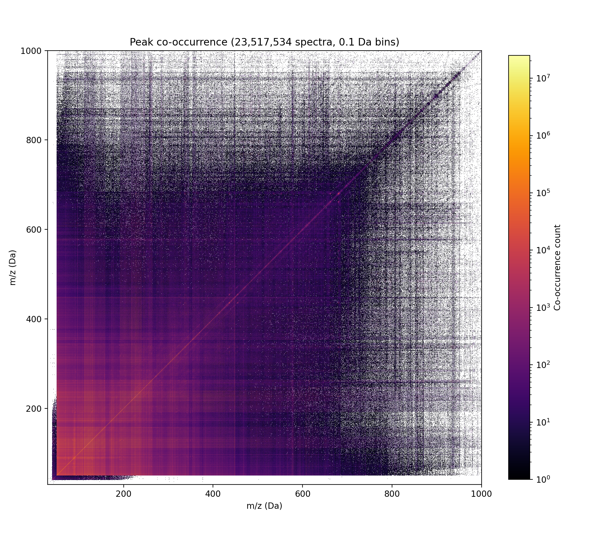

Same analysis at 0.01 Da (downsampled to 0.1 Da bins for display). The same macro structure is visible but with a grainier texture reflecting the 10× finer underlying resolution. The banding pattern is more detailed, and the transition from the hot low-m/z core to the sparse high-m/z region is sharper.

### PMI-normalized co-occurrence

#### 0.1 Da

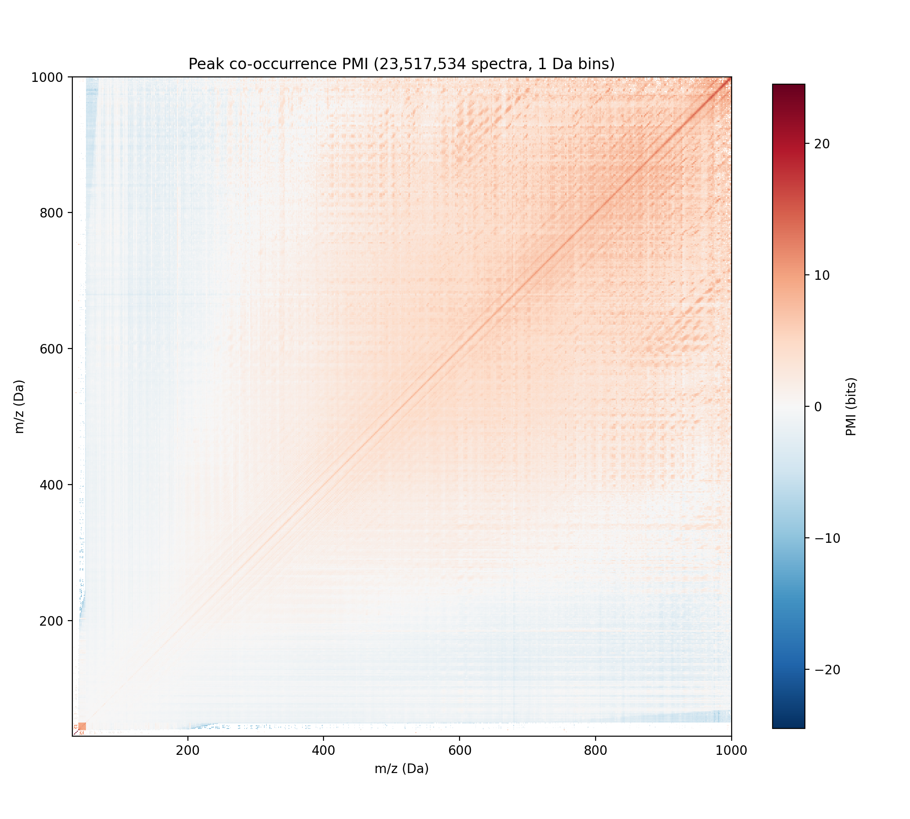

PMI(i,j) = log₂(N · cooc(i,j) / (count\_i · count\_j)). Diverging RdBu colormap centered at 0. Blue = peaks that co-occur less than expected under independence, red = more than expected. Note: the heatmap is computed from downsampled (1 Da) bin sums, so it is PMI-like rather than exact coarse-bin PMI. PMI is known to overemphasize rare pairs with low support; a minimum-count threshold or smoothing would strengthen these results.

The marginal-frequency bands from the raw heatmap largely disappear, highlighting departures from the independence baseline. Key features:

1. **Positive association block in the high-m/z region (800--1000 Da)** consistent with a higher-precursor-mass or less-extensively-fragmented subpopulation.
2. **Negative association between low-m/z and high-m/z fragments**, visible as the pale blue off-diagonal regions -- these peak groups co-occur less than expected under independence.
3. **Fine diagonal striping at ~14 Da intervals** consistent with homologous-series structure (CH₂-unit differences) -- fragments differing by one methylene unit tend to co-occur.

#### 0.01 Da

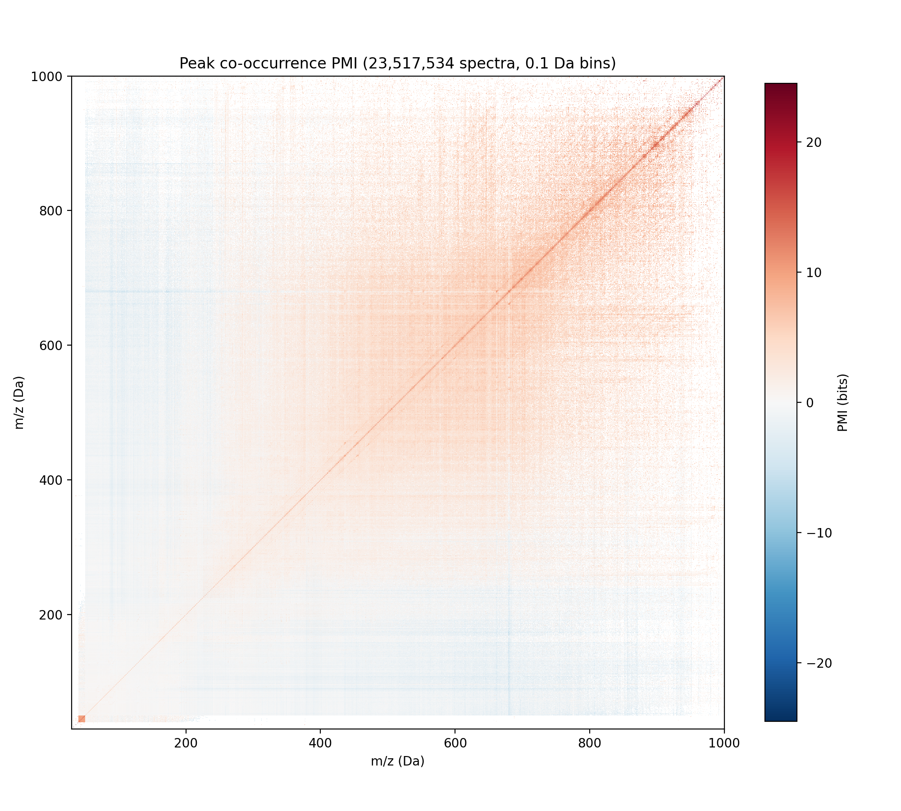

Same PMI analysis at 0.01 Da resolution (downsampled to 0.1 Da for display). The same three features are visible. The high-m/z positive block and the low-vs-mid-m/z anti-correlation are consistent across resolutions, confirming these are real population-level effects rather than artifacts of bin width.

## Visualization

Reproduce the plots with:

```bash
uv run scripts/plot_results.py --results-dir results/0.1da/
uv run scripts/plot_results.py --results-dir results/0.01da/
```

Run the distribution analysis with:

```bash
uv run scripts/analyze_distributions.py --results-dir results/0.1da/
uv run scripts/analyze_distributions.py --results-dir results/0.01da/
```

Requires Python 3.11+ (dependencies are declared inline via [PEP 723](https://peps.python.org/pep-0723/) (Python Enhancement Proposal for inline script metadata) and installed automatically by `uv run`).

## Future work

Derived metrics enabled by the counts and co-occurrence data:

1. **IDF-weighted cosine similarity** -- Use bucket counts as document frequencies: IDF(b) = log(N / count(b)). Weight peaks by IDF before cosine similarity, downweighting ubiquitous fragments (analogous to Term Frequency-Inverse Document Frequency (TF-IDF) in NLP).

2. **PMI-based spectral similarity** -- Use off-diagonal PMI scores from the co-occurrence matrix for cross-peak matching: when spectrum A has peak i and spectrum B has peak j, score the match by PMI(i,j) rather than requiring i == j. This captures soft associations between related but non-identical fragments. (Note: same-bucket PMI(b,b) reduces to a function of IDF, so the value here is in cross-peak scoring.)

3. **Positive PMI (PPMI) embeddings** -- Truncate negative PMI to zero, apply Singular Value Decomposition (SVD) to the PPMI matrix to obtain low-dimensional peak embeddings. A spectrum can then be represented as a weighted sum of its peak embeddings (e.g., intensity- or IDF-weighted), and spectral similarity becomes cosine similarity in embedding space.

4. **Entropy-based weighting** -- For each bucket, compute the entropy of its co-occurrence distribution: H(b) = -sum P(j|b) log P(j|b), where P(j|b) is the fraction of b's co-occurrences involving bucket j. Peaks with high entropy (diffuse co-occurrence across many partners) are less discriminative; peaks with low entropy (concentrated, predictable co-occurrence) are more specific and can be upweighted.

5. **Information-theoretic spectral distance** -- Use the co-occurrence matrix to define conditional distributions P(·|b) and compare spectra via Kullback-Leibler (KL) divergence or Jensen-Shannon divergence of their peak sets' conditional profiles.

6. **Learned bin widths** -- Use the count distribution to identify optimal non-uniform binning (narrower bins where peak density is high, wider where sparse).

7. **Background model for significance testing** -- Use the marginal distribution as a null model: given two spectra sharing k peaks, compute a p-value under the assumption of independent peak occurrence with observed frequencies.

## Conclusions

- Successfully processed 23.5M spectra at two resolutions (0.1 Da and 0.01 Da) with modest resource usage.
- The count distribution is approximately log-normal with extreme skew: the top 20 peaks each appear in >30% of spectra, while the majority of buckets have counts below 1,000. At 0.01 Da, 152 buckets are statistical outliers (z > 3 in log-space); at 0.1 Da, the log-normal tail accommodates even the highest counts.
- Raw co-occurrence is dominated by marginal frequencies; PMI normalization reveals association structure consistent with known mass spectrometry chemistry, including compound class segregation (low-m/z vs mid-m/z fragments), a high-m/z subpopulation likely driven by ¹³C isotope co-isolation, and CH₂-spaced diagonal striping.
- The general positive co-occurrence bias (obs/exp peaking at +2 to +4 bits) reflects the latent compound-class structure of the dataset -- the same statistical property exploited by Spec2Vec and MS2LDA.
- Fragment identities remain tentative: candidate molecular formulas are mass-consistent but not uniquely determined at 0.1 or 0.01 Da resolution. Proper identification would require cross-referencing against annotated spectral libraries.
- These statistics provide the ingredients for IDF-weighted and PMI-based spectral similarity metrics as alternatives to standard cosine similarity.

## Running tests

```bash
cargo test
```
